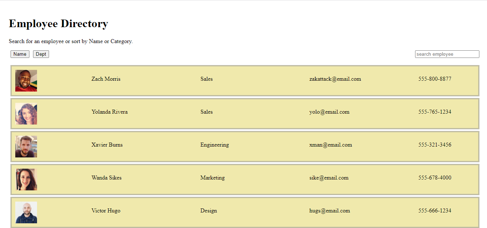

# Employee-Directory
## Description
The employee directory provides the opportunity for employers to filter out and access general information of their employees very easily. This application was built utilizing the react library in which the UI were broken up into components and onclick events were done through component methods. 
## User Story
* As a user, I want to be able to view my entire employee directory at once so that I have quick access to their information.
## Image

## Link
Github:
https://github.com/sid-666/Employee-Directory
Heroku:
https://employeedirectory803.herokuapp.com/

